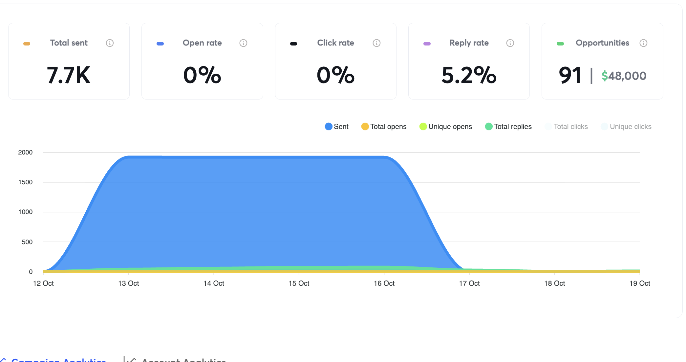
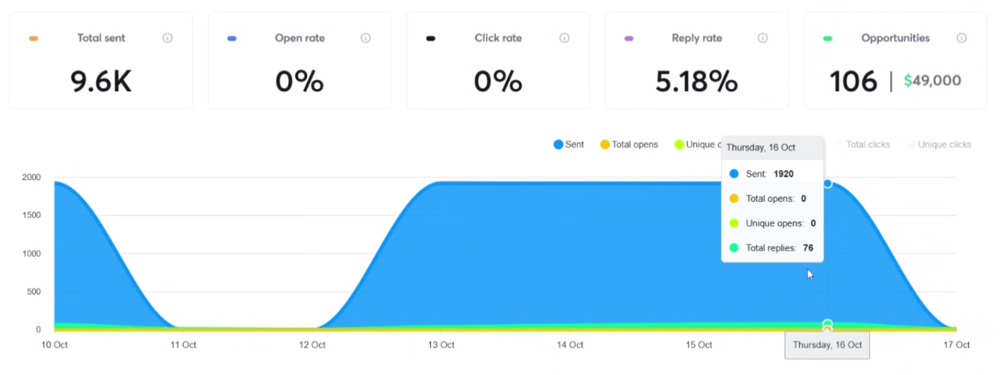
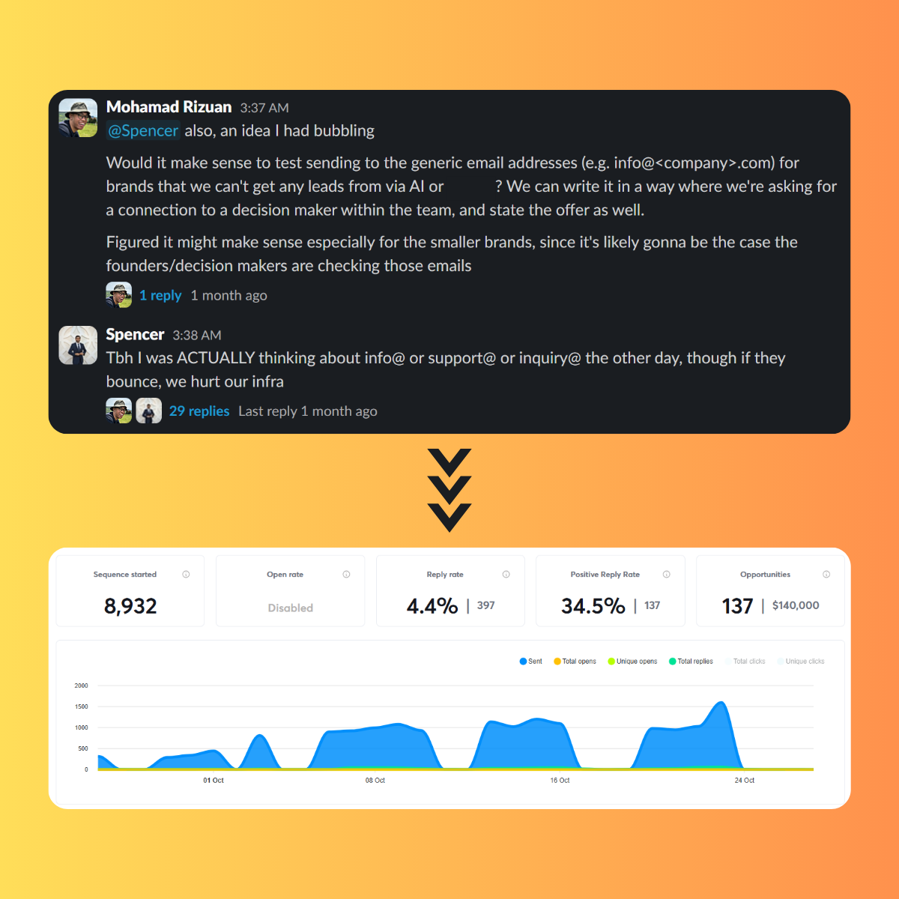

# Opener: scaling outbound past one rep

**Client:** Opener, AI sales agent that gets CPG brands into retail stores

**Role:** GTM Engineer, via Growth Alliance

**Timeframe:** 3 months

## Results

- **>5% reply rate** in an industry where 1–2% is typical
- **522 conversations** started with interested brands
- **~$1.9M** in pipeline influenced



## Context

Opener helps consumer packaged goods (CPG) brands get into more retail stores without hiring a sales team or paying brokers thousands a month in retainers. Their AI sales agent contacts store buyers, follows up, and keeps the conversation going until an order is placed.

They had a few paying customers and wanted to expand to more CPG brands in North America. Their outbound was handled manually by one sales rep, and their Head of Growth wanted to move him into a closing role.

**The task:** scale outbound past what one rep could do by hand, without losing the personalisation that made it work.

## What I built

### Two separate routes to building lists

The lists came from two independent sources. Each fed its own campaigns, and some brands appeared in both.

**Route A: a prioritised addressable market.** I built the account list with [Store Leads](https://storeleads.app/) and [BuiltWith](https://builtwith.com/), then used AI to qualify each company with two questions: _is this actually a CPG brand, and roughly how many retail stores already stock it?_ A brand in fewer stores has more room for Opener to add, so that estimate became the priority score for sorting the list.

**Route B: brands listed on Faire as a buying signal.** Brands list on [Faire](https://www.faire.com/), a wholesale marketplace, so store buyers will find them. A listing shows a brand actively wants to be on shelves, which makes it exactly Opener's customer. I scraped Faire's product listings with [Axiom](https://axiom.ai/) (including company names), pulled them into Clay, deduplicated companies, and enriched each brand for contacts. The listed products also gave us a natural opening line, e.g. _"Saw your coffee bean and cold brew listings on Faire."_

### Nine campaigns of testing

Opener had a strong offer. Our job was putting it in front of the right people. Across 9 campaigns, the winning versions used **one identical pitch with AI filling only two fields**:

- the company name, normalised to read like a person typed it
- a one-to-three-word category ("beer", "kombucha", "coffee beans")

The biggest gains came from refining the pitch after each campaign and sharpening the offer itself: **a set number of retail placements in 90 days, or the brand doesn't pay until they hit it.**

One version added a third personalised field: the brand's home region. AI read the company's site for its state or province, then mapped that to a broader region (New York → Northeast, Alberta → Prairies), and used it to ask if they wanted to expand into more retail locations there. Paired with the sharper offer, this was one of the best-performing versions we sent:

```
Hi {first_name} - came across Super Naturals Health while researching brands
expanding into retail. Amazing work you're doing.

Quick question: Was wondering if you want to expand into more retail
locations across the Southwest?

Our team (headed by an exited CPG founder) built a system to help F&B CPG
brands expand their retail presence without traditional brokers and sales
teams.

It uses AI to identify 50+ targeted retailers each week and manage outreach
and follow-ups on autopilot to those stores. Think: targeted retail BD on
autopilot.

You'll get 10 new retail partnerships in 90 days, or you don't pay.

50+ F&B brands are currently using this to scale faster and cheaper than
traditional broker models.

Open to a short 15m call to see if we can do the same for Super Naturals
Health?

—
{sender_first_name}
```



### Emailing the general inbox, not just a personal one

A third of Opener's addressable market was brands doing $250K–$10M a year, and most of that range sat in the lower half. AI and Clay's enrichment stack, which reliably found personal work emails for the rest of the list, simply couldn't find contacts for a lot of these companies — owners and heads of sales at small retail brands aren't active on LinkedIn the way a head of growth at a bigger company is.

What these companies did have was a general inbox: info@, sales@, hello@. My hypothesis was that a company small enough to be unreachable through normal enrichment was also small enough that the owner or decision-maker was checking that inbox themselves.

So we repackaged the pitch that was already working, sent it to the general address, and asked explicitly for a connection to whoever handled growth or retail partnerships. Here's an example email we sent:

```
Hi there,

Came across Big Beaver Brewing earlier - wanted to reach out while retail
stores are planning their holiday craft beer inventory.

Our team built a tool to help F&B CPG companies expand their retail presence
without using brokers or hiring a sales team. It uses AI to connect you to 50+
ideal stores per week (from our network of 1M+ stores) and automate all
outreach and follow-ups to those stores.

Thought this could help get your products on more shelves faster & cheaper
- and before this holiday restocking window closes.

If this sounds relevant/helpful, could you connect me with your
founder/CEO/head of sales - or anyone on the team who handles retail
partnerships?

Thanks!

—
{sender_first_name}
```

The only personalisation in that email is the company name and "craft beer" — the same minimal pattern from the nine campaigns above, applied here too. I had AI read each brand's site and summarise what they sold into a short phrase: "craft beer", "cookie", "coffee", "matcha powder". For brands with more than one product line, it picked whichever was most prominent, or just picked one. That one phrase was enough to make the email read like we'd actually looked at their site, without writing a bespoke line for each brand.



8,932 emails sent, a 4.4% reply rate (397 replies), and a 34.5% positive reply rate (137 conversations) — against a subset of the market we otherwise had no way to reach. At Opener's ~$3,600 average contract value, those 137 conversations put roughly **$493,200** into the pipeline already counted in the results above (the dashboard's own "$140,000" opportunities field uses a different, smaller multiplier — I'm using conversations × ACV here). It became our second-best-performing campaign out of all nine.

## What I took away

- **Personalisation only needs to be _enough_.** In one campaign, AI analysed each company and then wrote the entire email. It performed terribly. The sequence cost too much to run, the reply rate was under 1%, and nearly every reply was negative, mostly people confused about what we were offering. Two well-normalised fields in a proven pitch did far better. Personalisation doesn't have to cover the whole message.
- **The best signals come from where buyers already look.** A Faire listing told us more about intent than any firmographic filter could.
- **A company too small to have a findable contact is often small enough that the owner checks the general inbox.** When enrichment ran dry for smaller brands, sending to info@/sales@ and asking directly for a connection to a decision-maker outperformed most of our contact-based campaigns.
- **A strong offer beats clever copy.** Iterating on the offer moved results more than anything else.
