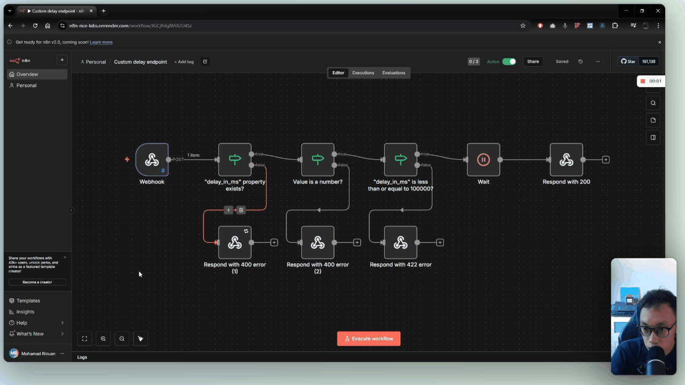

# Programmable timer: working around Clay's missing time-based run conditions

**Built for:** client outbound campaigns at Growth Alliance (used across several client builds)

**Role:** GTM Engineer, via Growth Alliance

**Timeframe:** late 2025 - early 2026 (Clay has since shipped native support for this; this workaround is no longer needed)

## Context

One of the recurring things I built for clients at Growth Alliance was an evergreen campaign table: a Clay table that runs automatically whenever a signal fires, in this case a funding round closing, pulled in via RSS. Every company that comes through gets sent to a separate, modular suppression-check table first: it takes a company domain, checks it against the client's blocklists, and outputs whether all checks have run and whether the company is OK to contact. That check normally takes 5–10 seconds, but can take longer when a batch of companies comes through the suppression-check table at once, since requests to the CRM are rate-limited.

Back in the original table, a second column looks up that result by domain and decides whether to move the company on to the next step. The problem: Clay doesn't support run conditions based on elapsed time, like "run 10 seconds after column A completes." So the lookup column fired immediately after the first column sent the company off to the suppression table, before the check had finished, found nothing, and failed. Not something you can leave unautomated.

## What I built

An n8n workflow that acts as a programmable timer, sitting between the two columns:

- **Webhook trigger** listening for POST requests, on a clearly-named path
- **IF nodes** that validate the request: does it contain the expected `delay_in_ms` property, is it a number, and is it under the delay ceiling I set
- **Wait node** that pauses for `delay_in_ms` (converted to seconds)
- **Respond node** that returns a success payload once the wait is over

In Clay, I added an HTTP API column right after the column that sends companies to the suppression table. That column calls the n8n webhook with a delay, e.g. `{ "delay_in_ms": 10000 }`. The lookup column's run condition then checks for a successful response from that webhook instead of running immediately. By the time the webhook responds, the suppression check has had time to finish, so the lookup reliably finds a result and the table runs end to end without manual intervention.

## How it's built

The validation in the IF nodes matters more than the Wait node itself:

- Reject the request if `delay_in_ms` is missing or not a number
- Cap the delay (I used 100,000ms). Clay already times out an HTTP column's request on its own after a certain period, so this cap wasn't about preventing the table from hanging - it kept the n8n-side request from running long, and it told whoever was calling the webhook the practical ceiling they had to work within
- Divide `delay_in_ms` by 1,000 before passing it to the Wait node, since n8n's Wait node works in seconds

Everything else is deliberately generic: the workflow doesn't know anything about suppression checks or funding rounds. It just takes a delay and returns success after that delay, which means the same webhook could be dropped into any Clay table that needed to wait on something slower than Clay's own run conditions could express.

## Walkthrough

## What I took away

- **Build the workaround generic, not one-off.** Because the workflow only takes a delay as input, it dropped into any table across any client that hit the same gap, instead of needing a bespoke version each time.
- **Knowing how to pair automation tools with no-code/low-code platforms matters.** Clay covers most of what a GTM workflow needs, but it will always have gaps. Being able to reach for something like n8n and build a small, purpose-built patch is what lets you keep the workflow fully automated instead of falling back to a manual step.
