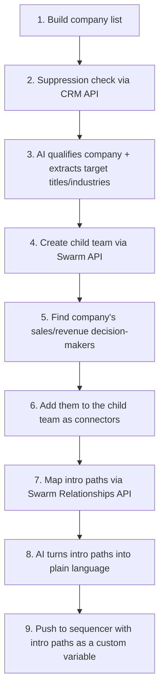

# The Swarm: showing instead of telling

**Client:** The Swarm, a relationship-intelligence platform that surfaces warm introduction paths for B2B sales

**Role:** GTM Engineer, via Growth Alliance

## Results

- **41 conversations** started with interested prospects
- **~$600K** in pipeline influenced
- A **Fortune 1000 company** that became one of The Swarm's customers
- An outbound play that works _and_ scales

## Context

The Swarm helps sales teams win business through warm introductions instead of cold outreach. It maps the combined networks of everyone connected to a company (employees, investors, advisors, customers), scores how strong each relationship is, and shows who can introduce you to a target account or person.

They had no BDRs or SDRs. Every conversation had to be generated for their Chief Growth Officer to take and close. And they sell into B2B SaaS, a saturated market whose executives get so many cold emails that they've stopped reading almost all of them.

**The task:** generate qualified opportunities in a market where readers had learned to delete emails like ours on sight.

Going into the first campaigns, my hypothesis was that warm intros were a strong, differentiated offer on their own merits, saturated market or not: buyers were growing more sensitive to cold outbound, and warm intros looked like a good alternative channel for generating new B2B opportunities. Most tools competing for the same job-to-be-done - better contact data, better signals - still routed back to that same cold-outbound channel. And at the time, The Swarm's only real competitor was Commsor; everywhere else in the category, tools had plenty of competition.

## What didn't work

For the first few campaigns, we started with two targeted lists, each fed into a static, broadcast campaign: companies that had recently hired a new Enterprise Account Executive, and companies that had recently brought on a new sales or revenue leader.

Here's an example we sent to the new-AE list:

```
Hi {first_name} - noticed {new_hire_first_name} joined your enterprise team.

The Swarm maps your company's team + stakeholder networks to reveal warm intro paths into key target accounts, plus relationship strength & who should make the introduction.

Most enterprise teams uncover thousands of warm intro paths they didn't know existed. Our clients ({case_study_customer_1}, {case_study_customer_2}, {case_study_customer_3}) use this to swap out cold outreach with introductions that convert 10X better.

Interested in seeing what's in network for your top 100 target accounts?

--
{sender_first_name}

P.S. please let me know if it's not a fit and I won't bother you any longer.
```

And to the new sales/revenue leader list:

```
Hey {first_name} - congrats on your new role as SVP of Sales.

Thought of sending over something useful - we mapped your team's networks and found 124 warm intro paths into accounts you're probably targeting. Most of these are hidden in LinkedIn, former colleague relationships, and overlap nobody's tracking - we created an algorithm to show these connections.

{case_study_customer_1} and {case_study_customer_2}'s teams use this so their sales reps can skip cold email & go straight to warm conversations, so thought you'll find this helpful too.

Curious to see the full breakdown? Can show you exactly who knows who + relationship depth.

--
{sender_first_name}

P.S. please let me know if it's not a fit and I won't bother you any longer.
```

Neither list converted.

We also tried two evergreen campaigns, triggered automatically off signals pulled into Clay: closed startup funding rounds, and companies posting new sales roles on LinkedIn. For the funding-round signal, I used [RSS.app](https://rss.app/) to turn [VC News Daily](https://vcnewsdaily.com/) into an RSS feed, which fed straight into a Clay table set up to receive RSS events - so every new funding round posted to the site landed in the table automatically, no manual pull needed. Example sent off that signal:

```
Hey {first_name},

Just saw the {lead_investor} news - congrats!

Besides the $20M, their portfolio is also a warm intro goldmine for you now. Saw some potential target accounts in there like {target_account_1} and {target_account_2}.

We can map your team's networks into {lead_investor}'s full portfolio - show you which accounts you have warm intro paths to + how strong those connections are. And that's just one use case of The Swarm.

Takes ~15 mins & might be helpful as you're planning GTM post-funding. Curious to see it?
```

And off the new-sales-role signal:

```
{first_name} - saw you might be bringing on an AE soon.

Had a question: any thoughts or plans on how to help them hit quota during/after ramp?

We built a tool that automatically maps warm intro paths to your target accounts. It shows the relationships (ex-colleague, former alumni, etc.), relationship strength, and who on your team should make the intro.

So far it's helped our users' reps book 3-5x more demos than with cold outreach. Curious if you'd want to test this with your team too.

Got 15 mins to see how it works?

--
{sender_first_name}
```

Both also didn't convert. My hypothesis was that **we were telling, not showing.** Every email described what The Swarm could do, but everyone in B2B SaaS makes claims like that and nobody believes them.

So we offered to map prospects' top accounts for free. Here's an example, sent as a follow-up:

```
{first_name} - clarifying what the warm intro mapping shows.

For each target account, you'll see:

- Who on your team or stakeholders knows who at {target_account}
- Strength of the relationship (confirmed, likely, potential)
- Relationship context (alumni, former colleagues, investor overlap, email, LinkedIn)

Our clients ({case_study_customer_1}, {case_study_customer_2}, {case_study_customer_3}) use this to replace cold outreach with warm introductions that convert 5X better.

Happy to map warm intro paths to your top 100-1,000 target accounts. Just share a list of domain names and we'll map intros for you.

--
{sender_first_name}

--
P.S. completely understand if this is not top of mind for now - just let me know.
```

But we still got silence. Then I realised that that wasn't really _showing_ either: prospects had to send us a list of domains before they saw anything.

## What worked: do the mapping first

If the first ask was the problem, the fix was to do the mapping _before_ emailing and put the result in the email. Mapping needs target accounts, though, and we didn't have the prospects' - so this became an actual pipeline, chained across several Clay tables and Swarm API calls, from a raw company list to a personalised email:



1. **Build a company list.** Source didn't matter - Clay's own enrichment, The Swarm's own data, anywhere a list could come from.
2. **Check suppression.** The Swarm kept a few lists in their Attio CRM of accounts and contacts that weren't to be cold-outbounded (current deals, investors), plus a Users object of existing Swarm users. A dedicated suppression-check Clay table took a company's domain, ran it against those lists and the Users object via Attio's API, and output whether all checks had run and whether the company was okay to contact. The original table looked up both values by domain and only let the company proceed once both were `true`. (I later built a [programmable timer](../programmable-timer/README.md) to patch a timing gap in this exact pattern, for The Swarm.)
3. **Qualify and extract targeting signals with one AI call.** Reading the company's site, the same call checked ICP fit (do they sell B2B), normalised the company name, and inferred the likely target titles and industries their sales team would sell to - industries selected from a predefined list the Swarm API accepts. Doing all of it in one call kept token cost down.
4. **Create a child team via the Swarm API**, following a standardised naming convention (child team names have to be unique). A child team doesn't have to be one company - it can hold people from anywhere.
5. **Find the company's sales/revenue decision-makers** (CRO, Head of Sales, VP Sales) - the people who'd actually care about intro paths, and who The Swarm sells to.
6. **Add them to the child team as connectors.** A connector is whoever's relationships The Swarm maps - the person who could make the intro. We only added sales/revenue people, not execs from other functions, on the hypothesis that a prospect's own sales team would recognise names in that group by sight, which mattered once those names showed up in an email.
7. **Map introduction paths** from the child team to people holding the target titles at the target industries from step 3, via [The Swarm's Relationships API](https://docs.theswarm.com/docs/endpoints/v3/relationships). Trimmed and anonymised, one entry in the response looks like this:

   ```json
   {
   	"count": 50,
   	"items": [
   		{
   			"profile": {
   				"id": "11111111-1111-1111-1111-111111111111",
   				"full_name": "{target_contact_name}",
   				"current_title": "VP, Business Development",
   				"current_company_name": "{target_account}",
   				"current_company_website": "example.com"
   			},
   			"connections": [
   				{
   					"sources": [
   						{
   							"origin": "work_overlap",
   							"shared_company": "{shared_company}",
   							"overlap_start_date": "2011-06-01",
   							"overlap_end_date": "2013-02-01",
   							"overlap_duration_months": 20
   						}
   					],
   					"connector_id": "22222222-2222-2222-2222-222222222222",
   					"connector_name": "{connector_name}",
   					"connector_current_title": "Managing Director",
   					"connector_current_company_name": "{connector_company}",
   					"connection_strength": 0.91,
   					"connection_strength_normalized": 3
   				}
   			]
   		}
   	],
   	"total_count": 215
   }
   ```

8. **Turn that JSON into plain-language intro paths with AI:**

   ```
   - Jordan Ashworth used to be colleagues with Priya Chandran (VP Transformation & Process Optimization @ Meridian Robotics) at Calloway Partners

   - Marcus Webb was also colleagues with Elena Torres (CFO) & Sam Whitfield (SVP CFO Global Operations) at Brightline Underwriters
   ```

9. **Push the contact into the sequencer** (we used Salesforge) with those intro paths as a custom variable, ready to slot into the email body:

   ```
   Hi {first_name} - mapped your team's networks and found intro paths to your likely target accounts:

   - Jordan Ashworth used to be colleagues with Priya Chandran (VP Transformation & Process Optimization @ Meridian Robotics) at Calloway Partners

   - Marcus Webb was also colleagues with Elena Torres (CFO) & Sam Whitfield (SVP CFO Global Operations) at Brightline Underwriters

   Built this list with The Swarm - it finds these connections & also shows you relationship strength.

   Happy to show you the full list of intros if you're curious?

   - {sender_first_name}

   P.S. if you have some actual target accounts you want to test mapping intros to, just share a list of domains & we can run it.
   ```

(Steps 2 through 9 ran fully automated end to end. The only manual step was pushing a company from the list built in step 1 into step 2 - everything after that needed no human intervention.)

Instead of telling them what the product could find, we sent them what it found.

## Rebuilding for scale: cutting action credit spend

Midway through, Clay introduced action-credit pricing: every external API or LLM call from a Clay table costs one credit, with a cap on how many you get. The workflow above, run entirely inside Clay, cost a minimum of 8 credits per company and 4 per contact - so scaling outreach meant cutting how many external calls Clay itself made, not doing less work.

The fix was pulling the calls that didn't need to live in Clay out into code, and wrapping each piece so Clay only ever made one call to get the result back.

**Suppression checks: 5 credits down to 1**

The suppression checks alone cost 5 credits per company. I rewrote the same Attio API calls as a Trigger.dev task in TypeScript, then wrapped that task in an Apify actor (JavaScript) that takes a company domain, kicks off a run of the task, polls until it completes, and returns the same "all checks run?" / "OK to contact?" flags back to Clay. Clay now makes one call - to the Apify actor - instead of five.

I didn't have Clay call the Trigger.dev task directly, because task runs are async: an API call to the task returns a run ID, not a result, so you need a second call to poll for completion. And since there's no upper bound on how long a task run takes, a single company could end up costing more than the 2 calls that pattern implies. Wrapping it in an Apify actor that blocks and polls internally keeps it to exactly one call from Clay's side, however long the task takes underneath.

**Child team creation through adding connectors: 2 credits per company, 2 per contact, saved**

Some steps needed to stay in Clay; the rest - creating the child team, the AI call that infers target industries and titles, finding decision-makers via The Swarm's people-search endpoint (one call to search, a second to fetch full profile data for the matched IDs), and adding them to the child team as connectors - got bundled into a single async Trigger.dev task.

Because this one runs async, Clay sends it the company's domain, HQ country, and LinkedIn URL, plus the webhook URLs of the Clay tables waiting for its output. The task does its work, then posts the results (child team ID, target titles, target industries) to those webhook tables directly. By this point Clay had shipped native support for time-based run conditions, so the table that looks up this data just sits behind a native delay rather than the workaround from the suppression-check step - the delay gives the task time to finish before Clay tries to read its output.

**Built to fail safely, not just cheaply**

Every external call - to Attio, The Swarm, and Clay's own webhooks - retries with exponential backoff on its own, and the task itself is also retried by Trigger.dev if it fails outright, with a longer backoff on top of that. Profile fetches and connector adds run in batches (up to 1,000 profile IDs, 100 connectors per call) instead of one call each, with short delays between batches to stay under rate limits. If a batch of profile fetches exhausts its retries, that batch is skipped and logged rather than failing the whole company - a partial result beats losing an otherwise-completed run.

## What I took away

**In a saturated market, the proof has to be in the first email.** Any ask that stands between the prospect and the value, even a free one, is friction they won't bother with.

**Tooling choices need to account for cost at volume, not just capability.** A platform can be capable of everything you need and still be the wrong choice once you scale, if its pricing scales faster than your workload does. Some tools cost more upfront but flatten out as volume grows; others, like Clay here, are cheap to start on but get expensive fast as enrichment gets more complex or volume ramps up. That curve is worth checking before committing to a platform, not just what it can technically do.
